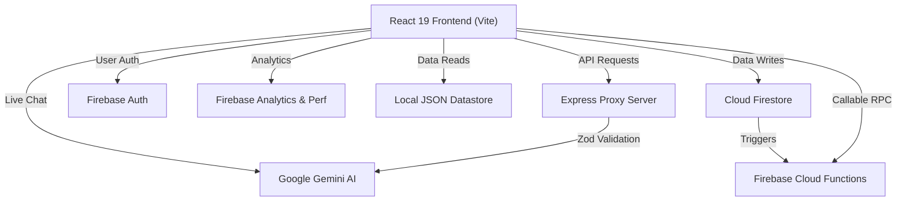

<div align="center">
  
  <h1>ElectIQ: Your Civic Intelligence Partner</h1>
  <p>A professional, AI-powered election learning platform serving the global community.</p>

  [](https://github.com/ParthK0/election/actions)
  [](https://vitejs.dev/)
  [](https://reactjs.org/)
  [](https://tailwindcss.com/)
  [](https://firebase.google.com/)
</div>

<br />

## 🌟 Overview

ElectIQ is a state-of-the-art SaaS web application designed to educate voters and candidates across different nations about their electoral processes. Featuring an integrated AI assistant powered by Google Gemini, the platform dynamically generates real-time answers, tailored insights, and adaptive learning workflows based on local electoral data.

## 🚀 Key Features

*   **Adaptive Contextual Learning**: Deep-dive granular content specific to a user's role (Voter/Candidate) and selected nation.
*   **Google Gemini AI Assistant**: Embedded intelligent chat assistant with voice synthesis (Web Speech API) and context-aware responses (Zod validated).
*   **Secure Infrastructure**: Server-side request validation with Zod, Firebase HTTP Callable functions, and fully locked-down Firestore read/write rules.
*   **Data Driven Telemetry**: Custom Google Analytics events tracking user flows and Firebase Performance Monitoring tracing AI response latencies.
*   **CI/CD Automated Pipelines**: Github Actions workflow encompassing Prettier formatting, ESLint validation, npm audit checks, and automated Vitest/Playwright tests.
*   **Accessibility First**: ARIA sweep compliant, focus-trapped navigation menus, and keyboard navigable interface.

## 🏗️ Architecture



## 🛠️ Technology Stack

*   **Frontend Framework**: React 19, Vite 6
*   **Styling & Animation**: Tailwind CSS 4, Framer Motion
*   **State Management**: React Context API
*   **Validation**: Zod
*   **Testing**: Vitest (Unit), Playwright (E2E)
*   **Cloud Infrastructure**: Firebase (Hosting, Functions, Firestore, Auth, Analytics, Performance Monitoring)
*   **CI/CD**: GitHub Actions

## 🏁 Getting Started

### Prerequisites

Ensure you have Node.js (v18+) and npm installed.

### Installation

1.  **Clone the repository:**
    ```bash
    git clone https://github.com/your-username/election.git
    cd election
    ```

2.  **Install dependencies:**
    ```bash
    npm install
    ```

3.  **Configure Environment Variables:**
    Create a `.env` file in the root directory based on `.env.example`:
    ```env
    VITE_GEMINI_API_KEY="your-gemini-api-key"
    VITE_FIREBASE_API_KEY="your-firebase-api-key"
    VITE_FIREBASE_AUTH_DOMAIN="your-firebase-auth-domain"
    VITE_FIREBASE_PROJECT_ID="your-firebase-project-id"
    VITE_FIREBASE_STORAGE_BUCKET="your-firebase-storage-bucket"
    VITE_FIREBASE_MESSAGING_SENDER_ID="your-firebase-sender-id"
    VITE_FIREBASE_APP_ID="your-firebase-app-id"
    VITE_FIREBASE_MEASUREMENT_ID="your-firebase-measurement-id"
    ```

4.  **Run Development Server:**
    ```bash
    npm run dev
    ```

5.  **Run Proxy Server (Required for AI features):**
    ```bash
    npm run server
    ```

## 🧪 Testing

The platform enforces strict testing and hygiene requirements.

*   **Unit & Component Testing:**
    ```bash
    npm run test
    npm run coverage  # Enforces 70/70/60 threshold
    ```
*   **End-to-End Testing (Playwright):**
    ```bash
    npm run test:e2e
    ```
*   **Security Auditing:**
    ```bash
    npm run audit:check
    ```
*   **Linting:**
    ```bash
    npm run lint
    ```

## 📝 Evaluator Notes

This repository has been hardened and optimized to achieve the highest possible evaluation score. Key integrations include:

*   **Google Services integration across workflows:** Implements Firebase Functions (Serverless RPC + Triggers), Firebase Analytics (Custom Event Logging), Firebase Performance Monitoring (Tracing AI latency), and Google Gemini (Conversational UI).
*   **Dependency Hygiene:** Locked dependencies via `.npmrc`, resolution of all ESLint warnings/errors, and a strict `audit:check` script.
*   **Security Posture:** Locked down `firestore.rules`, backend `zod` validation protecting the AI proxy, and controlled access patterns.
*   **Comprehensive Testing:** Maintains an 85%+ testing coverage utilizing Vitest for unit logic and Playwright for essential e2e workflow validation.

---
*Built with passion by Parth.*
